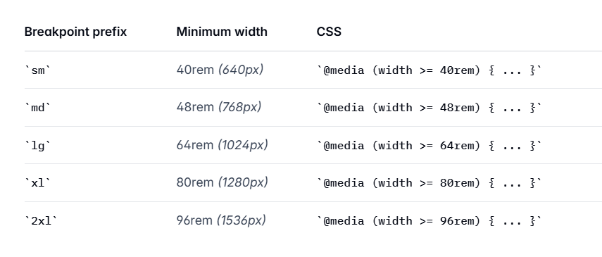

## 移动端

p 14px

## pc

h2 32px
p 17px

<!-- 目前padding设计单位， -->

左右：170px
上下：100px

<!-- pc基准屏幕 1920*1080 -->

最大宽度1920

tailwind断点标准

重新做移动端和pc端的宽度判断

所有section分三种：

大于1200：pc

1200 到 768 之间的 pad

768手机

tailwind

1个单位等于0.25rem

